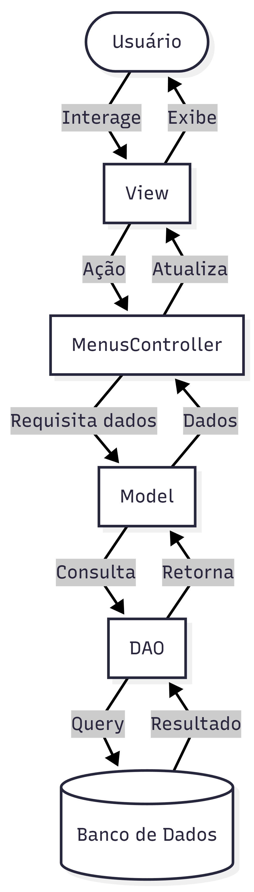
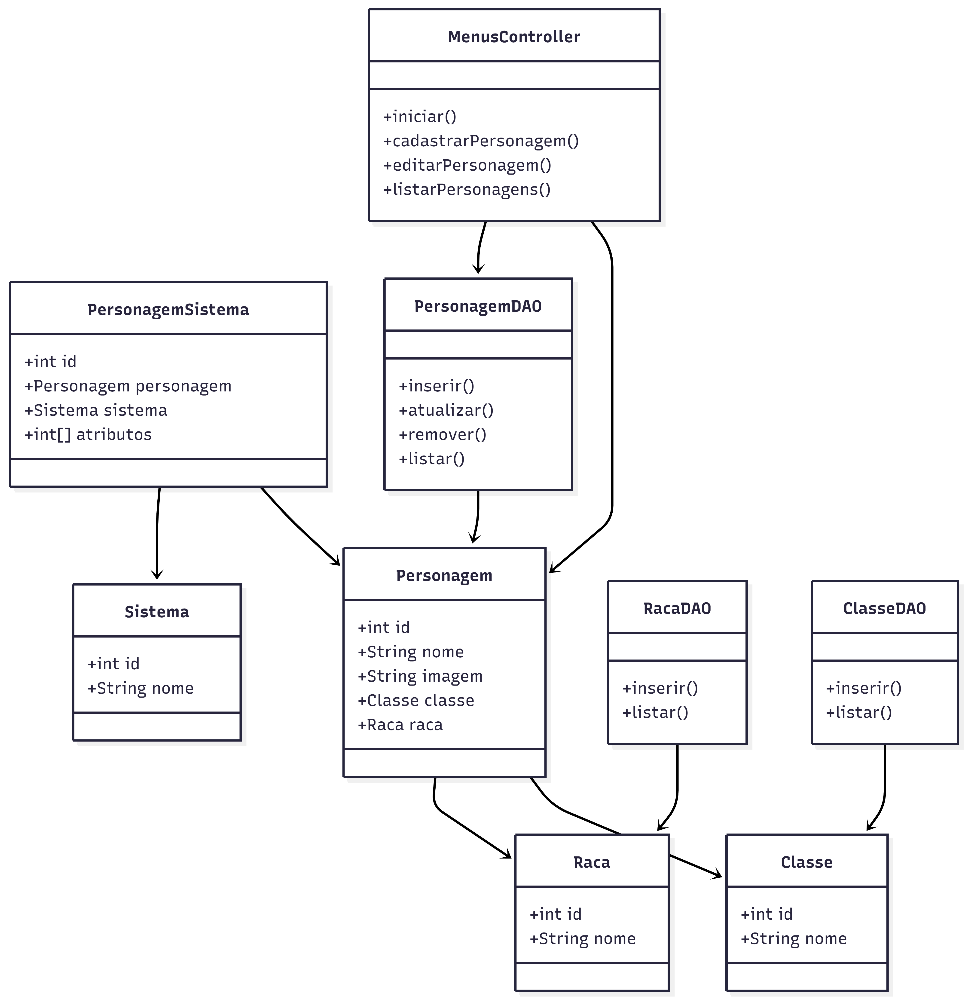

# RPG Character Creator

<div align="center">


*Software para criação e gerenciamento de personagens de RPG.*

**Universidade Estadual do Centro-Oeste — UNICENTRO**

</div>

---

## 📌 Sobre

O **RPG Character Creator** foi desenvolvido para a disciplina de **Programação Orientada a Objetos II** na UNICENTRO. O software simplifica a criação de personagens para jogos de RPG, permitindo cadastrar, editar e visualizar personagens com atributos detalhados.

**Por:** Arthur Linzing, Mateus Lopes, Yan Reis.

---

## 🖥️ Preview

<div align="center">
  
</div>

---

## ✨ Funcionalidades

### Principais
| Funcionalidade | Descrição |
|----------------|-----------|
| ➕ Cadastro | Adicione personagens com atributos detalhados e customizáveis |
| ✏️ Edição | Atualize informações de personagens já cadastrados |
| 👁️ Visualização | Consulte a lista completa de personagens cadastrados |

### Extras
| Funcionalidade | Descrição |
|----------------|-----------|
| 🖼️ Manipulação de Imagens | Associe e armazene imagens dos personagens no banco de dados |
| 🎲 Modo Aleatório | Gere atributos automaticamente com elementos surpresa |
| 🎯 Teste de Rolagem | Simule rolagens de dados para testar habilidades em tempo real |

---

## 🏗️ Arquitetura MVC + DAO
```
📁 RPGCharacterCreator/
├── 📁 controller/
│   └── MenusController.java
├── 📁 model/
│   ├── Personagem.java
│   ├── PersonagemSistema.java
│   ├── Classe.java
│   ├── Raca.java
│   └── Sistema.java
├── 📁 view/
│   ├── Menus.java
│   ├── TelaDefinirCaracteristicas.java
│   ├── TelaDefinirAtributos.java
│   ├── TelaVerPersonagens.java
│   └── TelaEditarPersonagens.java
├── 📁 dao/
│   ├── PersonagemDAO.java
│   ├── PersonagemSistemaDAO.java
│   ├── ClasseDAO.java
│   ├── RacaDAO.java
│   └── SistemaDAO.java
└── Conexao.java
```

---

## 📊 Diagramas

### Fluxo MVC


### Diagrama de Classes


---

## 🚀 Como Executar

**Pré-requisitos:** Java 22 e Maven instalados.

**1. Clone o repositório**
```bash
git clone https://github.com/CarboniArt/RpgRefatorado.git
cd RpgRefatorado/RPGPOOIIv3
```

**2. Execute pelo IntelliJ**

Abra o projeto e clique no ▶️ verde ao lado do método `main` em `Main.java`.

**3. Ou pelo terminal**
```bash
.\mvnw compile exec:java -Dexec.mainClass="com.trabalhojava.sistemarpg.main.Main"
```

---

## 👥 Autores

<table>
  <tr>
    <td align="center">
      <a href="https://github.com/CarboniArt">
        <br/>
        <sub><b>Arthur Linzing</b></sub>
      </a>
    </td>
    <td align="center">
      <a href="https://github.com/ShimiraOleg">
        <br/>
        <sub><b>Mateus Lopes</b></sub>
      </a>
    </td>
    <td align="center">
      <a href="https://github.com/yangabrielreis">
        <br/>
        <sub><b>Yan Reis</b></sub>
      </a>
    </td>
  </tr>
</table>

---

<div align="center">
  <sub>Programação Orientada a Objetos II — Universidade Estadual do Centro-Oeste (UNICENTRO)</sub>
</div>